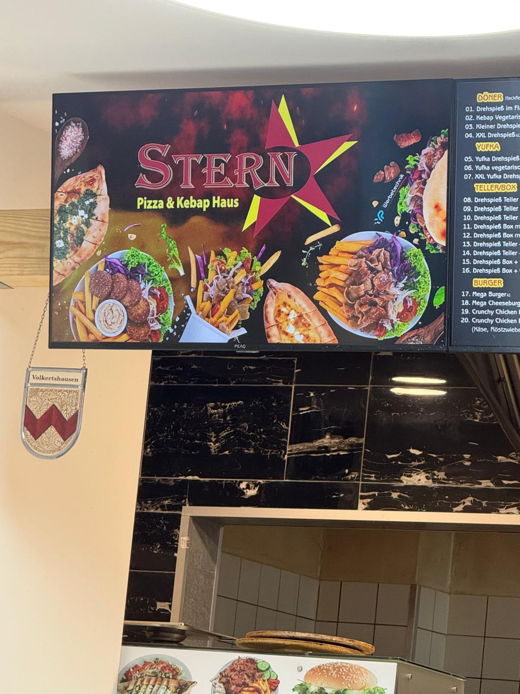

# Stern Pizza & Kebap Haus — Website

Vollständige Restaurant-Website mit eigenem CMS-Backend für das **Stern Pizza & Kebap Haus** in Volkertshausen. Entwickelt als Praxisprojekt mit dem Tech-Stack einer modernen Webagentur.

---

## Live Demo

> Lokal starten: XAMPP → Apache & MySQL starten → `http://localhost/stern-website/`  
> Admin-Panel: `http://localhost/stern-website/admin/login.php`

---

## Screenshots

| Hero-Bereich | Speisekarte | Admin-Panel |
|---|---|---|
|  |  |  |

---

## Tech Stack

| Technologie | Einsatz |
|---|---|
| HTML5 | Semantische Struktur, SEO-Grundlagen |
| CSS3 | Responsive Design, Flexbox & Grid, Keyframe-Animationen, Pseudo-Elemente |
| JavaScript (Vanilla) | Tab-Navigation, IntersectionObserver, Mobile Menu, Scroll-Effekte |
| PHP 8 | Backend-Logik, Session-Authentifizierung, PDO-Datenbankzugriff |
| MySQL | Datenbankschema, CRUD-Operationen |
| Git & GitHub | Versionskontrolle, Repository-Management |

---

## Features

### Öffentliche Website
- **Hero-Section** mit Grill-Textur-Effekt via CSS `::after` Pseudo-Element
- **Speisekarte** dynamisch aus MySQL-Datenbank — Kategorien: Döner, Pizza, Burger
- **Tab-Navigation** mit JavaScript ohne Page-Reload
- **Scroll-Animationen** via `IntersectionObserver` API
- **Sticky Navbar** die beim Scrollen schrumpft
- **Google Maps** Integration
- **Mobile-First** — vollständig responsive auf allen Bildschirmgrößen
- Farbpalette direkt aus dem Firmenlogo abgeleitet (`#8B1A4A` Weinrot + `#A8C63D` Gelbgrün)

### Admin-Panel (CMS)
- **Login** mit Session-Authentifizierung
- **Dashboard** mit Statistiken pro Kategorie und Filteransicht
- **Gerichte verwalten** — hinzufügen, bearbeiten, deaktivieren, löschen
- **Echtzeit** — Änderungen im Admin erscheinen sofort auf der Website
- Kein Framework, kein WordPress — eigenständig entwickelt

---

## Projektstruktur

```
stern-website/
├── index.php               # Hauptseite (lädt Speisekarte aus DB)
├── css/
│   └── style.css           # Gesamtes Styling
├── js/
│   └── main.js             # Interaktivität & Animationen
├── images/                 # Logo, Speisefotos, Storefront
└── admin/
    ├── config.php          # Datenbankverbindung & Konstanten
    ├── login.php           # Admin-Login mit Session
    ├── dashboard.php       # Übersicht aller Gerichte
    ├── gericht-form.php    # Gericht hinzufügen / bearbeiten
    ├── gericht-delete.php  # Gericht löschen
    └── logout.php          # Session beenden
```

---

## Datenbank

```sql
CREATE TABLE gerichte (
  id          INT AUTO_INCREMENT PRIMARY KEY,
  name        VARCHAR(100) NOT NULL,
  beschreibung TEXT,
  preis       DECIMAL(5,2) NOT NULL,
  kategorie   ENUM('doener', 'pizza', 'burger') NOT NULL,
  bild        VARCHAR(255),
  aktiv       TINYINT(1) DEFAULT 1
);
```

---

## Installation

```bash
# 1. XAMPP installieren (Apache + MySQL starten)

# 2. Projekt in htdocs kopieren
C:\xampp\htdocs\stern-website\

# 3. Datenbank anlegen
# phpMyAdmin → Neue Datenbank: stern_db
# SQL-Tab → Schema + Beispieldaten einfügen

# 4. Website aufrufen
http://localhost/stern-website/

# 5. Admin-Panel aufrufen
http://localhost/stern-website/admin/login.php
# Benutzername: admin
# Passwort: stern2025
```

---

## Was ich dabei gelernt habe

- Wie eine Webagentur denkt: der Kunde soll Inhalte selbst pflegen können, ohne Code anzufassen
- PHP Sessions für sichere Authentifizierung
- PDO mit Prepared Statements zum Schutz gegen SQL-Injection
- CSS Custom Properties für konsistentes Design-System
- `IntersectionObserver` als moderne Alternative zu Scroll-Events
- Git-Workflow: Commits, Remote-Repository, Merge-Konflikte lösen

---

## Geplante Erweiterungen

- [ ] Kontaktformular mit PHP Mailer
- [ ] Bildupload direkt im Admin-Panel
- [ ] Online-Bestellfunktion

---

## Entwickler

**Tiemo Ramjad**  
Informatik-Student · HTWG Konstanz  
[GitHub](https://github.com/ti911amj) · tiemoramjad2000@gmail.com

---

> Entwickelt als Portfolio-Projekt für eine Bewerbung im Bereich Web-Entwicklung.  
> Echtes Projekt · Echter Kunde · Echter Tech-Stack.
